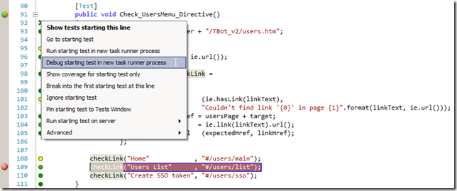
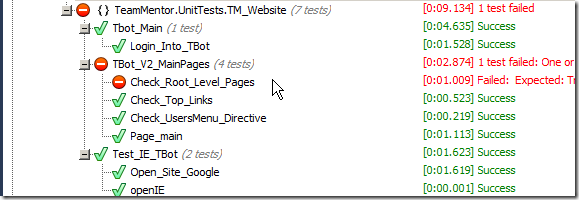
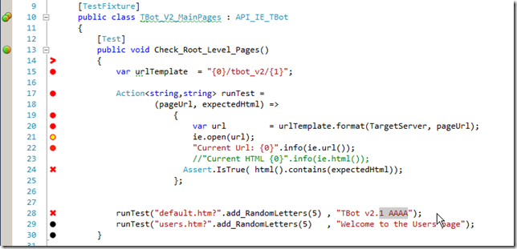

##  E2E testing AngularJS links and routes using NCrunch, VisualStudio and FluentSharp.WatiN 

In order to have real TDD while developing AngularJS inside VisualStudio, I needed a way to write C# Unit Tests that could be executed in the background by [NCrunch](http://blog.diniscruz.com/search/label/NCrunch) (i.e. in real-time during coding).

Since I wanted to do E2E (End-to-End) testing of the AngularJS app, I needed either a good mocking environment (like the one provided by KarmaJS/AngularJS Mocks) or the real thing (i.e. actually running the app on a local IIS/Cassini server).

If I have the choice, I always prefer to run my tests without mocking (or with as least amount of Mocks as possible), since that allows for a much more realistic test environment, and promotes much better engineering and coding practices.

This post shows how I created such environment and provides a couple examples of C# tests written to check if links created by AngularJS directives and routes are being correctively set.  
  
The objective is to be able to run a test that looks like this:

This unit test (written in C# inside VisualStudio) is opening up an AngularJS powered page in an IE 11 browser, and checking to to see if the expected links+urls are there.

To see this in action we can setup a breakpoint in one of the tests (line 109 below) and run the test under the debugger (using NCrunch in this case, but I could also had used the ReSharper NUnit test runner):

Here is what is looks like during execution:

   
**  
****Creating the IE TBot page**  
**  
**The '**_IE TBot'_** popup window that you can see at the background (image above),  was created by the **_IE_UnitTest_** class (below), which contains a static **_Current_** properly, and calls the extension method **_open_IE_** on its constructor:

The **_open_IE_** method is the one that creates the popup window, if there isn't already an instance created and stored in the **_Current_** property.

This really makes a massive difference in the speed of tests since there is no need (in most cases) to start a new instance of IE on a separate WinForm control (this is also compatible with NCrunch since there will be a level of reuse between executions)

The **_IE_UnitTest_** class is then extended by the **_API_IE_TBot_** which is the one that contains the **_TBot_** (TeamMentor Admin Bot) specific configuration:

... and methods:

Finally the **_API_IE_TBot_** is extended by the NUnit test class like the **_TBot_V2_MainPages_** (shown below) which is the one that also contains the **_Check_UsersMenu_Directive _**method shown in the beginning of this post:

   
**  
****  
****Seeing Unit Tests in action**  
**  
**One way to run the tests is to use ReSharper NUnit test runner:

Looking at the **_Check_Root_Level_Pages_** test (couple screenshots above) you will notice that we are testing for the presence of the "**_TBot v2.0" _**text (which is from the **_main.html_** page, that is mapped as a **templateUrl**,** **by the **_$routeProvider_** config mapping, defined in the **_routes.js_** file):

Here is what the **_main.html_** page looks like at the moment:  

If we change it to:

... and run the tests again (using ReSharper NUnit test runner), we will get a failed test:

This is already quite nice, but since I'm using **_NCrunch_**, I will be able to see this even faster :)

To see this in action, I can run the test from the **_NCrunch_** UI (or make a small change in the **_Check_Root_Level_Pages_** method)

... and the failed test and location will be nicely visualised like this:

Then as I edit the file, as soon as there is a change made, **_NCrunch_** (after about 1 sec of inactivity) will re-run the test:

... and one I got the fix right, the test will be green again:

It is hard to see/experience this type development environment in these screenshots, but it is really fast, and it really, really, really ...  improves my productivity and UnitTests coverage :)

**Another examples of similar AngularJS types of tests**

1) Check_Top_Links:

2) Login into TBot:

   
**  
****3) Bug_IE_Out_of_Sync_afer_REST_Call___PoC**  
**  
**
