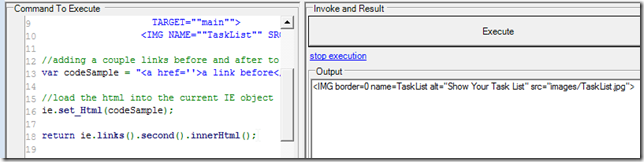

##  Finding a html link with no ID in the middle of a web page using WatiN (via IE objects and jQuery) 

When coding web automation scripts,  a common problem is that the target HTML element that we want to access doesn't have any id or attribute that we can use to map it.

This posts shows a number of examples on how to to find those HTML elements using [O2 Platform](http://blog.diniscruz.com/p/owasp-o2-platform.html)'s WatiN/IE extension methods.

Lets start with this html code sample (see end of post for the actual code)

If you execute it on a O2 Platform's [C# REPL GUI](http://blog.diniscruz.com/p/c-repl-script-environment.html) you should get something like this:

Note: our objective is to trigger the onClick event on the main link, which should pop up an alert:

**Example 1) CLICK THE LINK: Using list of links **  
**  
**The first way to click on the lists is to get a list of links:

find the one we want ( **_ie.links()[1])_** , **_ie.links().value(1)_** or **_ie.links().item(1)_** would also work, with the last two returning null if the index provided is took big)

(note how you get a lot of details about the current element in the Output window)

Once we have the link we want we can just. **_click()_** it :)

Tip: if you are doing a demo you might want to add a .flash() to highlight the element before clicking on it:

and use **_.disableFlashing()_** during development (so you don't have to wait for it):

**Example 2) CLICK THE LINK: Using innerHTML**  
**  
**Another way to find the link is to use the **_.innerHtml() _**value:

which can be used on a foreach loop:

to find and click it:

if you wanted to store the link in a strongly type variable, use the .**_getFullName()_** method to find the type:

And then use a variable to hold its value before you click it:

We can refactor this code by moving the **_WatiN.Core _**reference into an **_using_** statement (which can be anywhere on the script, but are usually included at the end)

and replacing the foreach with a lambda method:

and in this case we don't even need the **_foundLink_** variable:

or use a smaller text to search for the link:

**Example 3) CLICK THE LINK: Via an Image**  
**  
**Another way to find a link is to search for something that we know is inside it (like an image)

get its parent:

cast it into a **_Link _**object and click it:

Tip: you can use an element/image attributes to find the image/element you want:

  
**Example 4) CLICK THE LINK: Using jQuery**  
**  
**If you are a jQuery fan, then you can also use it to click on the link.

Start by adding jQuery (if not there)

And here is how to use jQuery to find the link:

And how to click on the link (using a jQuery selector):

**Tip:** Inject FireBug Lite to make your life easier writing the scripts:

which will allow to you try out your jQuery scripts:

That's it, let me know if this helps and if you have other ways to find those annoying HTML elements with no id attribute :)

### **Code samples used on this post**

here are some of the code samples used to create the screenshots shown above:

**Loading test HTML in Web Browser:**  

    
    var ie = panel.clear().add_IE().silent(false);   
    //original HTML that would be found in the middle of a big web page  
    var targetHtml = @"";

//adding a couple links before and after to make the sample a bit more realistic  
var codeSample = "<a href=''>a link before</a> {0}  <a href=''>a link after</a> ".format(targetHtml);

//load the html into the current IE object (you could also save the text as an HTML page and open that)  
ie.set_Html(codeSample);

return ie.IE.Html;  
  
**Clicking using innerHtml via foreach loop:**  

    
    var ie = panel.clear().add_IE().silent(false);   
    //original HTML that would be found in the middle of a big web page  
    var targetHtml = @"";

//adding a couple links before and after to make the sample a bit more realistic  
var codeSample = "<a href=''>a link before</a> {0}  <a href=''>a link after</a> ".format(targetHtml);

//load the html into the current IE object (you could also save the text as an HTML page and open that)

ie.set_Html(codeSample);

var innerHtmlToFind = "";

WatiN.Core.Link foundLink = null;

foreach(var link in ie.links())  
if (link.innerHtml() == innerHtmlToFind)  
{  
foundLink = link;  
break;  
}  
if (foundLink.notNull())  
foundLink.click();

return foundLink;

//return ie.links().second().innerHtml();

  
//O2File:WatiN_IE_ExtensionMethods.cs   
//O2Ref:WatiN.Core.1x.dll  
  
**Clicking using innerHtml via Lambda method:**  

    
    var ie = panel.clear().add_IE().silent(false);   
    //original HTML that would be found in the middle of a big web page  
    var targetHtml = @"";

//adding a couple links before and after to make the sample a bit more realistic  
var codeSample = "<a href=''>a link before</a> {0}  <a href=''>a link after</a> ".format(targetHtml);

//load the html into the current IE object (you could also save the text as an HTML page and open that)

ie.set_Html(codeSample);

var innerHtmlToFind = "name=TaskList alt=\"Show Your Task List\" src=\"images/TaskList.jpg\">";

  
return ie.links()  
.where((link)=> link.innerHtml() == innerHtmlToFind)  
.first()  
.click();

  
//using WatiN.Core  
//O2File:WatiN_IE_ExtensionMethods.cs   
//O2Ref:WatiN.Core.1x.dll  
  
**Click using an Image's parent:**  

    
    var ie = panel.clear().add_IE().silent(false);   
    //original HTML that would be found in the middle of a big web page  
    var targetHtml = @"";

//adding a couple links before and after to make the sample a bit more realistic  
var codeSample = "<a href=''>a link before</a> {0}  <a href=''>a link after</a> ".format(targetHtml);

//load the html into the current IE object (you could also save the text as an HTML page and open that)

ie.set_Html(codeSample);

var link = (Link)ie.images().first().Parent;  
link.click();  
return "link clicked";

//using WatiN.Core  
//O2File:WatiN_IE_ExtensionMethods.cs   
//O2Ref:WatiN.Core.1x.dll  
  
**Click using jQuery**  

    
    var ie = panel.clear().add_IE().silent(false);   
    //original HTML that would be found in the middle of a big web page  
    var targetHtml = @"";

//adding a couple links before and after to make the sample a bit more realistic  
var codeSample = "<a href=''>a link before</a> {0}  <a href=''>a link after</a> ".format(targetHtml);

//load the html into the current IE object (you could also save the text as an HTML page and open that)

ie.set_Html(codeSample);

ie.inject_jQuery();

ie.eval("$('a').eq(1).click();");

//using WatiN.Core  
//O2File:WatiN_IE_ExtensionMethods.cs   
//O2Ref:WatiN.Core.1x.dll  

