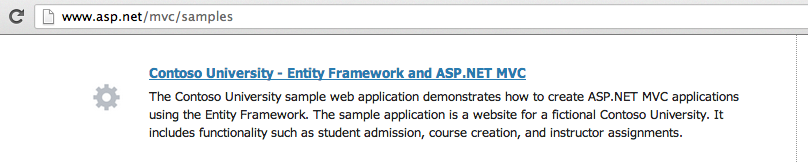
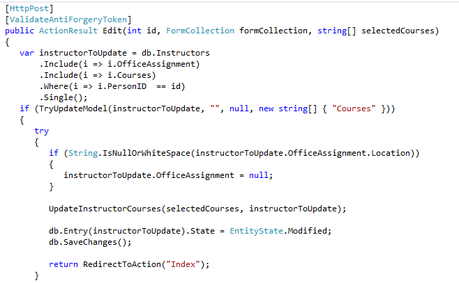
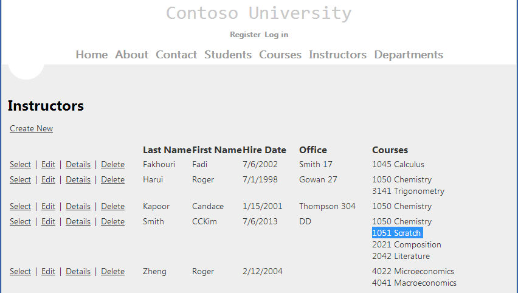
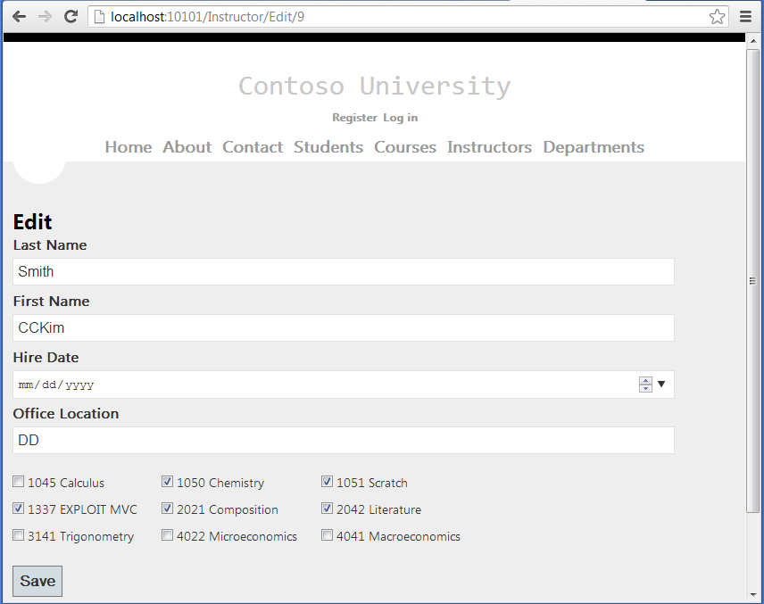
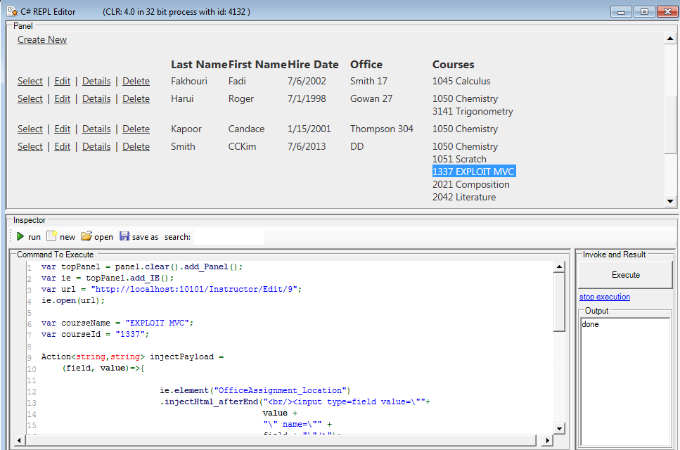

##  MVC ModelBinding Vulnerability in Contoso University sample (first raw PoC) 

While on the [plane to Vegas](http://blog.diniscruz.com/2013/07/day-1-made-it-to-vegas-start-of-aspnet.html), I looked at a number of ASP.NET MVC apps (ping me if you know of other good ones to look at (with publicly available source code)).

I was trying to find one that had good examples of MVC ModelBinding Vulnerabilities (aka overposting), in a real-world-kinda-way (I have found tons of MVC ModelBinding Vulnerability examples which usually get dismissed with a _'that is not the recommended way to code MVC controllers'_).

So I think I found a great example (of what not to do) on the Contoso University sample.

This application is explained in detail in this article [Creating an Entity Framework Data Model for an ASP.NET MVC Application (1 of 10)](http://www.asp.net/mvc/tutorials/getting-started-with-ef-using-mvc/creating-an-entity-framework-data-model-for-an-asp-net-mvc-application)  and can be downloaded from [http://code.msdn.microsoft.com/ASPNET-MVC-Application-b01a9fe8/view/SourceCode](http://code.msdn.microsoft.com/ASPNET-MVC-Application-b01a9fe8/view/SourceCode) (as shown below, you can also get this from the official ASP.NET MVC website)

Remember that this is how developers learn about programming ASP.NET MVC, so it is important that the code samples they have access to (from reputable sources like http://www.asp.net/mvc) are rock solid and don't have MVC ModelBinding Vulnerabilities.

A quick look at the code showed numerous vulnerable controllers, and in this first (raw) PoC example, we are going to exploit the public **ActionResult Edit(int id, FormCollection formCollection, string[] selectedCourses) **method from the  [InstructorController.cs](http://code.msdn.microsoft.com/ASPNET-MVC-Application-b01a9fe8/sourcecode?fileId=93127&pathId=2009908151%20code.msdn.microsoft.com/ASPNET-MVC-Application-b01a9fe8/sourcecode?fileId=93127&pathId=2009908151) file.

This is what the vulnerable code looks like:

  

  

Here is the list of current Instructors (note the extra course on [Scratch](http://scratch.mit.edu/) (added in a previous execution of the PoC)

  
Here is the page that is used to edit an Instructor's details (and the one we will use on the exploit)

Here is the source code of the exploit PoC:

Here is the execution of the code shown above (with a new course on _'Exploit MVC' _which was added by the exploit)

  
This is actually an interesting scenario, specially since the affected controller tries to prevent injection into the Courses field :)

My next series of blog posts will explain how this works, and how it was possible to **_'add a new course while editing an Instructor details'_**
